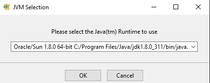
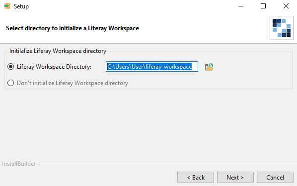
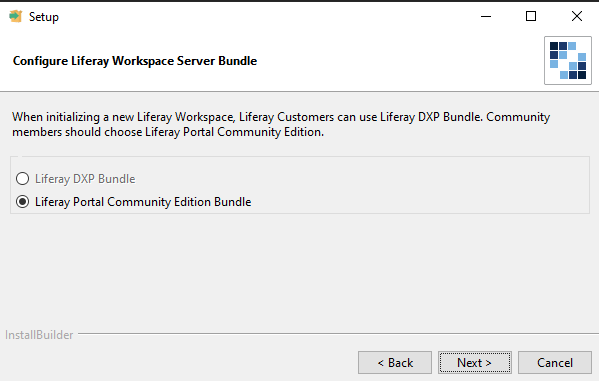
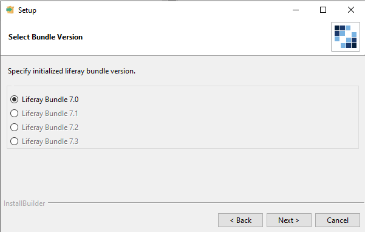
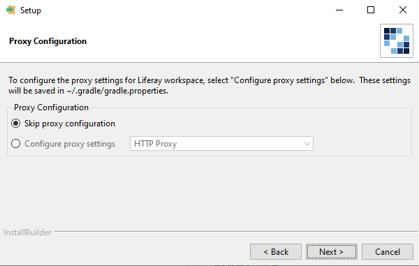

# Создание портлета Liferay 7.0 с использованием React JS

### 1. Установка компонентов Liferay
Для создания правильного каркаса портлета требуется установить специальный компонент от Liferay. 
Для этого переходим на сайт  [Liferay Portal IDE](https://sourceforge.net/projects/lportal/files/Liferay%20IDE/ "Liferay Portal IDE") (либо скачиваем из архива [Liferay Portal IDE](https://sourceforge.net/projects/lportal/files/Liferay%20IDE/ "GIT ZIP") может быть уже устаревшей версией), выбираем файл подходящий под вашу операционную систему и скачиваем его. 
Перейдем к установке (Windows):
1. Выбираем установленную версию Java JDK;  

2. Устанавливаем желаемое расположения каталога с коммандером (запоминаем путь);  

3. Ставим версию Portable Community;  

4. Далее выбираем версию Liferay;  

5. Если есть прокси можем их установить.  


### 2. Создание каркаса портлета
Переходим в директорию, куда установили компонент Liferay. Далее перемещаемся в папку `modules`. Именно здесь мы будем создавать новые портлеты. Теперь запускаем `cmd` и вписываем следующие команды:
```sh
blade create -t war-mvc-portlet -v 7.0 -p ru.allorion.portlet -c AllorionMvcPortlet allorion-mvc-portlet-project
```
где 
- `blade create` - внутренняя команда Liferay для создания портлетов;
- `-t war-mvc-portlet` - выбор желаемого шаблона портлета;
- `-p ru.allorion.portlet` - путь до исполняемых файлов Java;
- `my-mvc-portlet-project` - название папки портлета, а т.ж название отображаемого портлета в списке портлетов Liferay.

> Обращаю внимание, для корректной работы портлета на Liferay 7.0 требуется использовать именно war архив с портлетом и именно mvc. Иначе портлет попросту не будет работать.

### 3. Настройка портлета для работы с React JS

##### 3.1. Импорт Gradle в проект
Проект создался с базовым функционалом и без всякого мусора. Теперь для полноценной работы требуется добавить в прпоект Gradle (Если он отсутствует на PC сначала устанавливаем его и прописываем в Path `ставим новую версию`). После установки Gradle переходим в корневую директорию проекта, удаляем файл `build.gradle` и вызываем консоль. Добавим Gradle в проект:

```sh
gradlew init
```

Обращаю внимание, что при выборах следует указывать `basic`, `Groovy`, `дефолтное название проекта`

##### 3.2. Обновление зависимостей Liferay 

Перейдем к обновлению зависимостей Liferay для функционирования портлета. Открываем в любом редакторе кода (IDE) файл `build.gradle` и вставляем следующий код:

```gradle
buildscript {
    repositories {
        maven {
            url "https://cdn.lfrs.sl/repository.liferay.com/nexus/content/groups/public"
        }
    }

    dependencies {
        classpath group: "com.liferay", name: "com.liferay.gradle.plugins.css.builder", version: "latest.release"
        classpath group: "com.liferay", name: "com.liferay.gradle.plugins.node", version: "latest.release"
    }
}

apply plugin: "com.liferay.css.builder"
apply plugin: "war"
apply plugin: "com.liferay.node"

dependencies {
    compileOnly group: "com.liferay.portal", name: "com.liferay.portal.kernel", version: "latest.release"
    compileOnly group: "javax.portlet", name: "portlet-api", version: "latest.release"
    compileOnly group: "javax.servlet", name: "javax.servlet-api", version: "latest.release"
    cssBuilder group: "com.liferay", name: "com.liferay.css.builder", version: "latest.release"
    compileOnly group: "org.osgi", name: "org.osgi.service.component.annotations", version: "latest.release"
    compileOnly group: "com.liferay.portal", name: "com.liferay.util.taglib", version: "latest.release"
    compileOnly group: "jstl", name: "jstl", version: "latest.release"
}

repositories {
    mavenLocal()
    maven {
        url "https://cdn.lfrs.sl/repository.liferay.com/nexus/content/groups/public"
    }
}

war {
    dependsOn buildCSS
    exclude "**/*.scss"

    filesMatching("**/.sass-cache/") {
        it.path = it.path.replace(".sass-cache/", "")
    }

    includeEmptyDirs = false
}

task deleteIndexFile(type: Delete) {
    delete "${rootDir}/src/main/webapp/js/index.html"
}

task cleanJsDir(type: Delete) {
    delete "${rootDir}/src/main/webapp/js/"
}

war {
    dependsOn deleteIndexFile
}

clean {
    dependsOn cleanJsDir
}
```

Для проверки зависимостей можем прописать в консоль:
```ssh 
gradlew build
```

Если проект собрался переходим к следующему шагу. 

##### 3.3. Добавляем зависимости React Js, а т.ж. подули для его компиляции
Создадим в корневом каталоге файл `package.json`, добавляем следующий код:

```json
{
  "name": "react-front",
  "version": "1.0.0",
  "description": "MVC Portlet with React JS and Webpack",
  "devDependencies": {
    "babel-core": "^6.25.0",
    "babel-loader": "^7.1.1",
    "babel-polyfill": "^6.23.0",
    "babel-preset-es2015": "^6.24.1",
    "babel-preset-react": "^6.24.1",
    "css-loader": "^0.28.4",
    "file-loader": "^0.11.2",
    "html-webpack-plugin": "^2.30.1",
    "liferay-npm-bundler": "^2.13.3",
    "path": "^0.12.7",
    "style-loader": "^0.18.2",
    "url-loader": "^0.5.9",
    "webpack": "^3.5.0",
    "bootstrap": "^4.6.1",
    "react-bootstrap": "^2.1.1"
  },
  "scripts": {
    "start": "webpack-dev-server",
    "build": "webpack"
  },
  "repository": {
    "type": "git",
    "url": "https://github.com/Allorion/liferay-react-portlet.git"
  },
  "author": "allorion.ru",
  "license": "MIT",
  "dependencies": {
    "axios": "^0.25.0",
    "react": "^17.0.2",
    "react-dom": "^17.0.2",
    "rgbcolor": "^1.0.1",
    "bootstrap": "^4.6.1",
    "react-bootstrap": "^2.1.1"
  }
}
```

Устанавливаем модули с помощью `npm install`

##### 3.4. Создаем автоматическую компоновку проекта

Создадим в корневом каталоге проект новый файл `webpack.config.js` и вставляем следующий код:

```js
const path = require('path');
const HtmlWebpackPlugin = require('html-webpack-plugin');
const SRC = path.resolve(__dirname, 'app');
const DEST = path.resolve(__dirname, 'src/main/webapp/js');

module.exports = exports;

const NAME_PORTLET = "app";

module.exports = {
  entry: {
    app: SRC + '/' + NAME_PORTLET + '.jsx'
  },
  resolve: {
    extensions: ['.ts', '.tsx', '.js', '.jsx'],
  },
  output: {
    path: DEST,
    filename: NAME_PORTLET + '.js'
  },
  module: {
    rules: [
      {
        test: /\.(js|jsx|ts|tsx)$/,
        include: SRC,
        use: ['babel-loader'],
        exclude: path.resolve(__dirname, "node_modules")
      },
      {
        test: /\.(css|scss)$/,
        loader: "style-loader!css-loader"
      },
      {test: /\.(s[ca]ss)$/,
        use: ['style-loader', 'css-loader', 'sass-loader', {
          loader: "postcss-loader",
          options: {
            postcssOptions: {
              plugins: [
                [
                  "postcss-preset-env",
                  {
                    // Options
                  },
                ],
              ],
            },
          },
        }]
      },
      {test: /\.(woff|woff2)(\?v=\d+\.\d+\.\d+)?$/, use: ['url?limit=10000&amp;mimetype=application/font-woff']},
      {test: /\.ttf(\?v=\d+\.\d+\.\d+)?$/, use: ['url?limit=10000&amp;mimetype=application/octet-stream']},
      {test: /\.eot(\?v=\d+\.\d+\.\d+)?$/, use: ['file']},
      {test: /\.svg(\?v=\d+\.\d+\.\d+)?$/, use: ['url?limit=10000&amp;mimetype=image/svg+xml']}
    ]
  },
  plugins: [
    new HtmlWebpackPlugin({
      template: './app/index.html',
      filename: 'index.html',
      inject: 'body'
    })
  ]
};
```

Дабы не было ошибок при обработке синтаксиса реакта добавим файл `.babelrc` в корневую директорию. Добавим в него следующий код:

```
{
  presets: ['es2015', 'react']
}
```

##### 3.5. Добавление простейшего кода React JS

В корне проекта создаем папку app. В нее помещаем один файл `index.html` и файл `app.jsx` (название файла выбираете любое, только не забудьте поменять в `webpack.config.js` в поле `NAME_PORTLET`)

`index.html`

```html
<!DOCTYPE html>
<html>
<head lang="en">
    <meta charset="UTF-8">
    <title>React Home Page static Test</title>
    <style></style>
</head>
<body>
    <div id="input"></div>
</body>
</html>
```

** Блок `div` с `id=input` является маяком для Liferay именно по этому id он будет видеть портлет **

Теперь добавим файл `app.jsx`

```jsx
import React from 'react';
import ReactDOM from 'react-dom';


function Welcome(props) {
    return <h1>Привет, {props.name}</h1>;
}

const element = <Welcome name="Алиса" />;

ReactDOM.render(
    element,
    document.getElementById('input')
);
```

Для примера был выбран элементарный скрипт написанный на React JS. Не забудьте добавить файл `.babelrc` иначе портлет собираться не будет.

##### 3.6. Настройка вывода шаблонов React JS

После того как мы добавили React JS нам следует объявить об этом Liferay. Открываем следующий файл `\src\main\webapp\view.jsp` .
Здесь мы указываем `div` с id `input`, а т.ж. наименование скрипта React JS (данное имя указывается в `webpack.config.js` в данной строке `filename: NAME_PORTLET + '.js'`. Обязательно указываем полный путь. Т.к. в том же `webpack.config.js` в строке `const DEST = path.resolve(__dirname, 'src/main/webapp/js');` мы указали папку `js`, то и в пути до скрипта мы ее указываем `src="<%=request.getContextPath()%>/js/app.js"`)
```jsp
<script>
    var allorionMvcPortletProject = {
        portletNamespace : '<portlet:namespace />',
        downloadFullURL: '${downloadURL}'
    };
</script>
```
В данном пункте меняем название переменно на название нашего портлета.

Пример полного кода файла

```jsp
<%@ include file="init.jsp" %>

<div id="input"></div>
<script src="<%=request.getContextPath()%>/js/app.js"></script>

<portlet:resourceURL var="downloadURL">
    <portlet:param name="file_id" value="id" />
    <portlet:param name="p_p_resource_id" value="downloadFile" />
</portlet:resourceURL>

<script>
    var allorionMvcPortletProject = {
        portletNamespace : '<portlet:namespace />',
        downloadFullURL: '${downloadURL}'
    };
</script>
```

### 4. Deploy portlet

Все настройки портлета выполнены. Осталось его только собрать. Для этого используем специальную команду. Открываем корневую папку проекта и вызываем в ней консоль. Далее прописываем:
```ssh
gradlew clean build
```
Gradle собирает проект в `war` файл. Теперь остается лишь запушить портлет на сервер Liferay.

### 5. Немного о главном

- Используя React JS мы используем его модули. В Liferay они не установлены, поэтому их следует добавлять вручную в файле `package.json`. Они прописываются в разделе `dependencies`, в примере данный раздел находится в самом низу;
- Не забывайте про файл `.babelrc` он обязателен для сборки портлета с React JS;
- Настройки позволяют собирать стили прописанные в `app.jsx`. Внимание данные стили будут распространяться и на другие портлеты. Чтобы это избежать можно добавлять стили в файл `\src\main\webapp\css\main.scss`;
- Для использования Bootstrap 4 добавляем в `app.jsx` импорт `import 'bootstrap/dist/css/bootstrap.min.css';`. 
---
###### Ссылки:

 * [Git разработчика](https://github.com/Allorion)
 * [Сайт разработчика](https://allorion.ru)
 * [Liferay Portal IDE](https://sourceforge.net/projects/lportal/files/Liferay%20IDE/)
 * [Liferay](https://www.liferay.com/)
 * [React JS](https://reactjs.org/)

@by Allori 2021
